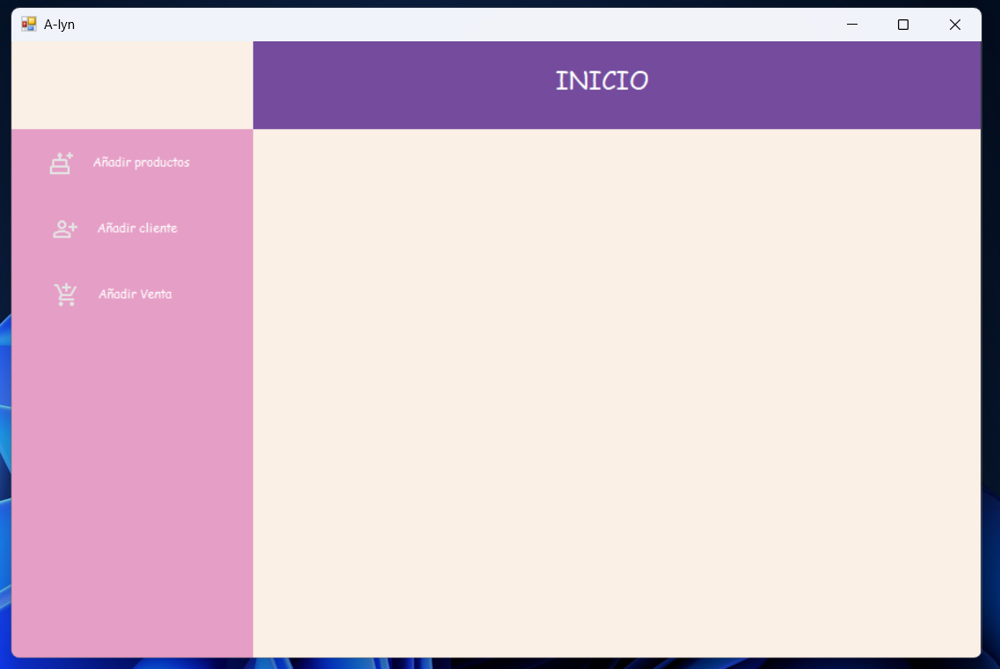
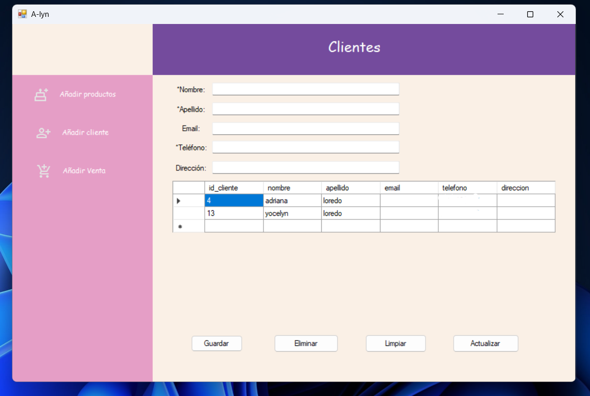

# InventorySalesSystem

Aplicación de escritorio en C# (.NET WinForms) para el manejo de productos, clientes, ventas e inventario con integración en SQL Server.

## Características
- Gestión de productos
- Gestión de clientes
- Registro de ventas con actualización de inventario

## Tecnologías
- C# / .NET Framework 4.8
- WinForms
- SQL Server

## Pantallas y funcionalidades
- Pantalla de inicio: Contiene tres botones, cada uno se despliega dentro del contenedor de Inicio con sus respectivas funciones.
  - Añadir productos.
  - Añadir cliente.
  - Añadir venta.
  

- Pantalla de Productos:
  - Contiene 5 cuadros de texto que solicitan de manera obligatoria los datos de: nombre, categoría y descripción del producto.
  - Sus 4 botones:
    - Limpiar: Limpia todos los datos de los cuadros de texto
    - Añadir producto: Guardar el productos con su nombre, categoría y descripción en la base de datos.
    - Eliminar producto: Del despliegue de los datos puedes seleccionar uno y se elimina
    - Actualizar: Del despliegue de los datos seleccionas uno, cambias sus existencias, nombre, precio, cualquiera de los datos del cuadro de texto y se actualizan en la base de datos.
  

- Pantalla de Clientes:
  - Contiene 5 cuadros de texto que solicitan de manera obligatoria los datos de: nombre, apellido y teléfono del producto.
  - Sus 4 botones:
    - Limpiar: Limpia todos los datos de los cuadros de texto
    - Guardar: Guardar el pcliente con su nombre, apellido y teléfono en la base de datos (por motivos de privacidad no muestro los números de teléfono en la captura).
    - Eliminar: Del despliegue de los datos seleccionas un cliente y se elimina.
    - Actualizar: Del despliegue de los datos seleccionas uno, cambias cualquiera de los datos del cuadro de texto y se actualizan en la base de datos.
  

## Author
Adriana Loredo

