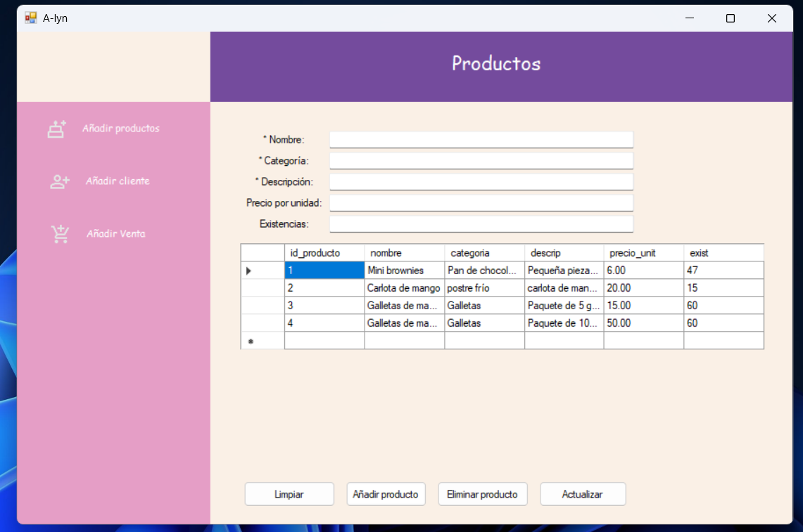

# InventorySalesSystem

Aplicación de escritorio en C# (.NET WinForms) para el manejo de productos, clientes, ventas e inventario con integración en SQL Server.

## Características
- Gestión de productos
- Gestión de clientes
- Registro de ventas con actualización de inventario
- Muestra de ventas registradas con filtros por fechas

## Tecnologías
- C# / .NET Framework 4.8
- WinForms
- SQL Server

## Pantallas y funcionalidades
- Pantalla de inicio: Contiene tres botones, cada uno se despliega dentro del contenedor de Inicio con sus respectivas funciones.
  - Añadir productos.
  - Añadir cliente.
  - Añadir venta.
    
  

- Pantalla de Productos: Contiene 5 cuadros de texto que solicitan de manera obligatoria los datos de: nombre, categoría y descripción del producto.
  - Sus 4 botones:
    - Limpiar: Limpia todos los datos de los cuadros de texto
    - Añadir producto: Guardar el productos con su nombre, categoría y descripción en la base de datos.
    - Eliminar producto: Del despliegue de los datos puedes seleccionar uno y se elimina
    - Actualizar: Del despliegue de los datos seleccionas uno, cambias sus existencias, nombre, precio, cualquiera de los datos del cuadro de texto y se actualizan en la base de datos.
      
  

- Pantalla de Clientes: Contiene 5 cuadros de texto que solicitan de manera obligatoria los datos de: nombre, apellido y teléfono del producto.
  - Sus 4 botones:
    - Limpiar: Limpia todos los datos de los cuadros de texto
    - Guardar: Guardar el pcliente con su nombre, apellido y teléfono en la base de datos (por motivos de privacidad no muestro los números de teléfono en la captura ni los apellidos).
    - Eliminar: Del despliegue de los datos seleccionas un cliente y se elimina.
    - Actualizar: Del despliegue de los datos seleccionas uno, cambias cualquiera de los datos del cuadro de texto y se actualizan en la base de datos.
      
  

- Pantalla de Ventas: Contiene 2 barras de texto que te permiten navegar entre el nombre del cliente y nombre del producto.
  - Un cuadro de texto que unicamente permite numeros para elegir la cantidad del producto o productos que deseas.
  - Una tabla que te va mostrando los productos que vas agregando.
  - Sus 3 botones:
    - Agregar: Cada que coloques un producto y su cantidad tienes que darle agregar, esta información se irá mostrando debajo.
    - Registrar: Guardara la venta en la base de datos con el nombre del cliente, la fecha y los productos.
    - Ventas registradas: Abre una nueva ventana.
      
  

- Ventas registradas: Se abre por encima de la pantalla de ventas, para mostrar el historial de las ventas registradas. Contiene dos barras para seleccionar de que fecha a que fecha quieres filtrar.
  - Su unico botón:
    - Filtrar: Muestra las ventas registradas en el rango de fechas otorgado.
   
  

Actualmente se siguen haciendo cambios en el apartado de ventas, a esto se debe que no muestre esa pantalla

## Author
Adriana Loredo

